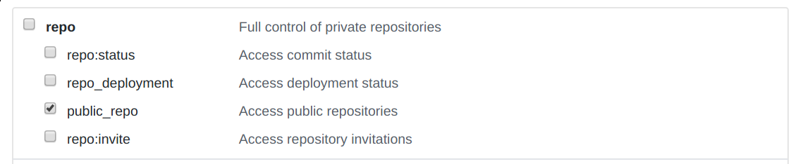

neighbor: examples

## Installing "Commands"
```bash
go install ./...
```

## GitHub Access Token

First, you must create an access token in GitHub with at least the following privileges.



## Example "Commands"

[open-pull-request](./open-pull-request) - adds a LICENSE file and opens a pull request on a repository.
